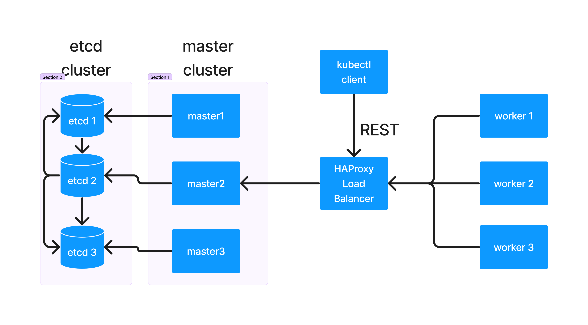
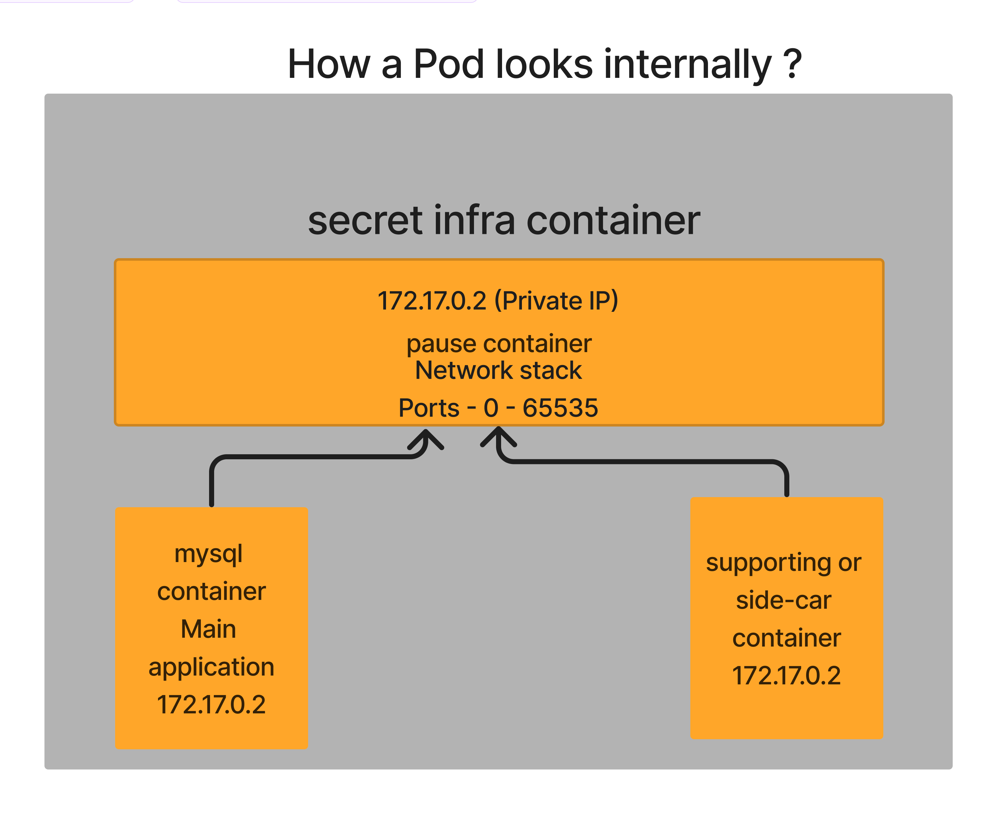

# Day 2

## Info - Container Orchestration Platform Overview
<pre>
- Container Orchestration Platforms supports below features
  - HA availability to our applications
  - Scale up/down applications either manually/automatically based on traffic or rules
  - Rolling update
    - Upgrading application from one version to other without any down time
    - Revert to older stable version if new version is found to be unstable or faulty
  - Defining Network Policy
    - control who can access certain applications
    - control which applications within container orchestration can access other applications running in container orchestration platform
  - In built monitoring facility
    - to check the health of our applications periodically and repair them when required
    - to check if our application is not just running but it is also responding
    - performance
    - checking application logs for troubleshooting
 - User Management
   - Role Based Access Control to ensure only authorized users can access your applications securely
 - Service
   - decide what is the scope of your application
   - should it be restricted to cluster-level access or should it be accessible 
     outside the orchestration platform as well  
- Examples
  - Docker SWARM
  - Google Kubernetes
  - Red Hat Openshift
</pre>

## Info - Docker SWARM
<pre>
- is Docker's native Container Orchestration Platform
- is opensource
- it is light-weight, hence can be setup quickly in a laptop/desktop with normal system configuration
- very user-friendly, good for learning, R&D, dev/qa setup
- not a production-grade Container Orchestraiton Platform
- supports only Docker based containerized application workloads
</pre>

## Info - Kubernetes
<pre>
- is an opensource Container Orchestration Platform from Google
- Developed in Go lang
- easy to setup, robust, time tested
- it is production-grade
- mostly command-line, doesn't support production-grade Dashboard
- community support is there, in case you are struck with some production issues
- Kubernetes can be installed locally ( on-prem ), public/private/hybrid clouds
- AWS, Azure, GCP also provide managed Kubernetes Clusters in their public cloud
- The popular Managed Kubernetes Services are
  - AWS - eks (Elastic Kubernetes Service )
    - One can get support from Amazon 
    - they are very expensive than Azure but highly reliable
    - more reliable than Azure
  - Azure - AKS ( Azure Kubernetes Service )
    - One can get support from Microsoft
    - they are very expensive though
- One big difference between Docker SWARM and Kubernetes
  - Docker SWARM only supports Docker containerized application workloads
  - Kubernetes supports any Container Runtime/Engine that implements the CRI
- Supports 3 types of Services
  - ClusterIP Service (Internal service)
  - NodePort Service ( External Service )
  - LoadBalancer Service ( External Service - generally used in public cloud environments like eks/aks )
    - in order to support this in on-prem k8s setup, we could use Metallb operator
- Kubernetes 
  - allows deploying application only using existing container images
  - not possible to deploy application from source code
- Kubernetes allows one to extend the Kubernetes features by 
  - Custom Resource Definitions (CRD)
  - Custom Controllers
  - Custom Operators
</pre>

## Info - Kubernetes High Level Architecture


## Info - Red Hat Openshift
<pre>
- it is Red Hat's Distribution of Kubernetes
- Red Hat Openshift comes with many additional features on top of Kubernetes
- Red Hat Openshift is an Enterprise product that comes with commercial license when used for profit
- supports both CLI and Webconsole Graphic User Interface
- supports User Management
- supports all the features offered by Kubernetes
- Supports many additional features
  - Route to access your application externally with a user-friendly url
- S2I ( Source to Image ) - new feature which is supported by Openshift and not available in Kubernetes
  - this allows one to deploy application from source code ( GitHub, GitLab, etc )
  - application build can be done within Openshift
- Virtualization 
  - can be done within Red Hat Openshift
- Openshift also enforces many best practices unlike Kubernetes
- Openshift reserves ports 0 thru 1024 for internal use, they are not available for user applications
- Openshift supports only Red Hat Enterprise Core OS (RHCOS) in Openshift master nodes
- Openshift allows using either Red Hat Enterprise Linux(RHEL) or RHCOS in Openshift worker nodes
- Openshift recommends using RHCOS in master and worker nodes
- In case your Openshift cluster uses RHCOS for master nodes and RHEL in worker nodes, then upgrading Openshift from webconsole or using oc command will not work
- Openshift supports new features like Build, BuildConfig which aren't supported by Kubernetes 
- comes with Prometheus monitoring tool with Graphana visual dashboards pre-integrated
- comes with pre-integrated RedHat marketplace from where we could selectively install additional operators
- comes with Internal Image Registry
- Public cloud vendors like AWS and Azure provided Managed Red Hat Openshift clusters
  AWS
  - ROSA
  Azure
  - ARO
</pre>

## Info - Cluster
<pre>
- Group of physical servers or Group of virtual machines running locally, or a group of ec2 instances running in public AWS cloud
- cluster is a group of servers
  - these servers are normally called nodes
  - these servers comes with some Operating Systems
  - there are types of servers
    1. Master Node
    2. Worker Nodes
- In a Cluster, there will be many master and worker nodes, put together they are called cluster
</pre>

## Info - OpenShift Master Node
<pre>
- this can be Physical Server or a Virtual Machine locally or on cloud with RHCOS Operating System installed in it
- this nodes comes with pre-installed Podman Container Engine and CRI-O container runtime
- common components 
   - kube-proxy
   - CoreDNS
   - kubelet 
- In Kubernetes/Openshift Master Nodes a special set of components will be running 
- the special set of components are officially referred as Control Plan Components
- control plane components
  - API Server (Pod)
  - etcd (Pod)  
  - Scheduler (Pod)
  - Controller Managers (Pod)
- Control Plane components collectively supports the Container Orchestration features
</pre>

## Info - Openshift Worker Node
<pre>
- this can be a Physical Server or a Virtual Machine locally or on cloud with either RHEL or RHCOS Operating System installed in it 
- Red Hat recommends installs RHCOS in both master and worker nodes
- this is where user applications will be running
- in addition to the user applications, some minimal Openshift common components also runs there
  - kubelet - a service that communicates with the CRI-O Container Runtime via the CRI interface
  - kubelet runs on both master and worker nodes
  - kube-proxy, CoreDNS
</pre>

## Info - Red Hat Enterprise Core OS (RHCOS)
<pre>
- its an optimized small-footprint Linux Operating System based on RHEL
- it comes with pre-installed Podman Container Engine and CRI-O Container Runtime
- it enforces many restrictions
  - many folders are made read-only
  - certain folders are allowed to be modified by certain Operators alone
- ports from 0 upto 1024 are reserved for internal use
- user applications are allowed to run only as non-admin users, hence container images with root user won't work normally in OpenShift
</pre>

## Info - Red Hat Openshift High-Level Architecture


## Info - Pod Overview
<pre>
- is a collection of related containers
- in other words, a group of containers
- is a logical group of related containers
- is the smallest unit that can be deployed into Kubernetes/Openshift
- containers within the same Pods shares the same IP Address and Ports
- there are atleast two containers per pod
  - one secret infra-container which is invisible in Openshift but visible in Kubernetes ( this containers provides network features )
  - application container
- as per industry best practice, only one application is supposed to run per Pod
</pre>  


## Info - API Server Overview
<pre>
- this is a Pod 
- is part of Control Plane components
- supports loads of REST APIs for every feature supported by Kubernetes/Openshift
- this is the only component that is allowed to read/write etcd database
- this is the heart of Kubernetes/Openshift
- most critical component
- API Server just creates, updates, deleted records in etcd key/value database
- each time API Server updates something in the etcd it will trigger broadcasting events
- all the components in K8s/Openshift only communicated to API Server, they aren't aware of any other components
- all the other components they communicate with API Server via REST API calls
- the API Server after satisfying the request responds back via broadcasting events
</pre>

## Info - etcd Overview
<pre>
- is a Pod
- is part of Control Plane components
- is a distributed key-value based database
- it is an opensource database
- it is an independent product developed outside of the scope of Kubernetes/Openshift, hence anyone can use this
- Kubernetes & Openshift is using the independent etcd database to store the cluster state and application states
- in case one wishes to recover a crashed k8s/openshift cluster, if have backup of etcd it is easy to recover/replicate the cluster else where
</pre>

## Info - Scheduler Overview
<pre>
- this is a Pod
- is part of Control Plane components  
- schedules the new Pod to a healthy node
- scheduler by itself can't schedule a Pod to run on any node, it can only send the scheduling recommendations to API Server via REST calls
- Scheduler get's notifications from API server via events whenever new Pods are created
</pre>

## Info - Controller Managers Overview
<pre>
- is a Pod
- is part of Control Plane components
- is a group of Controllers
  - Deployment Controller
  - ReplicaSet Controller
  - DaemonSet Controller
  - StatefulSet Controller
  - Job Controller
  - Node Controller
  - CronJob Controller
  - Endpoint Controller
</pre>

## Info - Deployment Overview
<pre>
- this is meant for deploying stateless applications
- the Pods can be deployed on any node, they can moved around to any node without any restrictions
- when a deployment is created it will deployment, replicaset and pod
- Deployment is a resource or Kubernetes/Openshift object
- It is YAML file stored inside etcd database
- The deployment YAML file is used as input by the Deployment Controller
- This represents your stateless application running within K8s/Openshift cluster
- Responsible for Rolling update
- This monitors the replicaset
</pre>

## Info - ReplicaSet Overview
<pre>
- this is a YAML file stored within etcd database
- this is one of the K8s/Openshift resource/object
- this is used an input to ReplicaSet Controller
- this captures information like how many Pods are supposed be running, what container image should be used, etc
- This resource is managed by ReplicaSet controller
- Monitors the pods
</pre>

## Info - Pod Overview
<pre>
- this is a YAML file stored within etcd database
- this is one of the K8s/Openshift resource/object
- this is the smallest unit that can be deployment and managed by K8s/Openshift cluster
- Within each Pod, there is one hidden pause container that takes care of networking aspects of a Pod
- Within each Pod, there will be one main application container
- Optionally each Pod, may also have some side-car(helper) container
</pre>

## Lab - Finding openshift version
```
oc version
kubectl version
```

## Lab - Listing all the nodes in the Red Hat Openshift cluster
```
oc get nodes
```

## Lab - Finding more details about a node
```
oc describe node/master01.ocp4.palmeto.org
```

## Lab - Create a new project
Replace 'jegan' with your name
```
oc new-project jegan
```

## Lab - Finding your currently active project
```
oc project
```

## Lab - Listing all projects
```
oc get projects
```

## Lab - Switching between projects
```
oc project
oc project default
oc project
oc project jegan
```


## Lab - Deleting your project ( Please don't delete any other projects as it will corrupt openshift setup )
The below command will delete everything inside the project.
```
oc delete project jegan
```

## Lab - Creating your first application deployment into your project
```
oc project jegan
oc create deployment nginx --image=bitnami/nginx:latest --replicas=3
```

List all deployments in your project
```
oc get deployments
oc get deployment
oc get deploy
```

List all replicasets in your project
```
oc get replicasets
oc get replicaset
oc get rs
```

List all pods in your project
```
oc get pods
oc get pod
oc get po
```

## Lab - Finding more details(meta-data) about deployments, replicaset and pods
```
oc describe deploy/nginx
oc describe rs/nginx-c7f5d84f9
oc describe pod/nginx-c7f5d84f9-85vvj
```

## Lab - Scale up your deployment
```
oc project jegan
oc get deploy
oc scale deploy/nginx --replicas=5
oc get po -w
```

In order to change the imagePullPolicy in the deployment, you need to edit the deploy
```
oc edit deploy/nginx
```

Change the imagePullPolicy from Always to IfNotPresent and save it.  Remember it is case sensitive.

Now you may check the pods you scale up will be in running state
```
oc get pods
```

## Lab - Deleting a deployment
The delete deploy/web command will delete deployment by web, the replicasets under the web deployment and all the pods running within the deployment.
```
oc project jegan
oc get deploy
oc delete deploy/web
```
