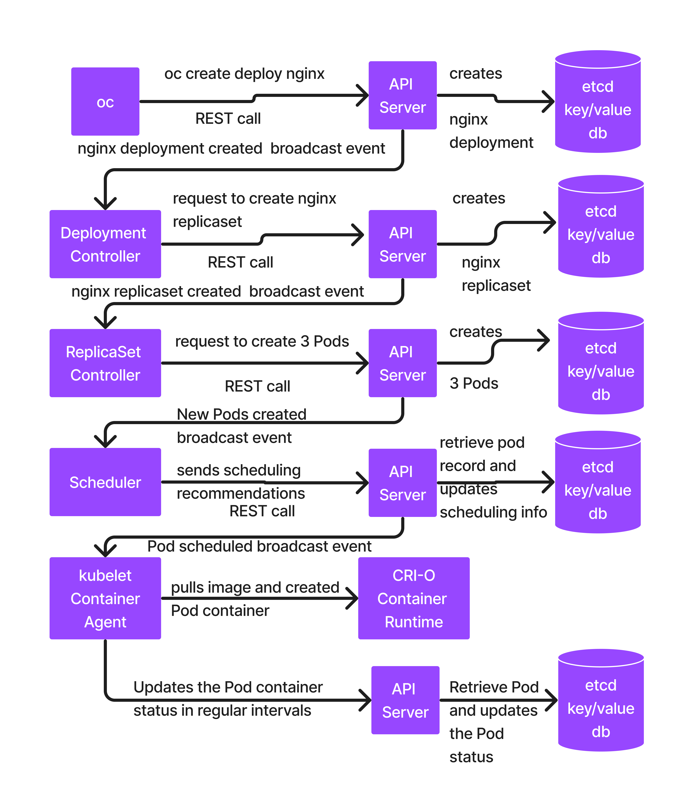

# Day 3

## Info - What happens when we run the below command?
```
oc create deployment nginx --image=bitnami/nginx:latest --replicas=3
```

The below chain of activities happen internally within the Kubernetes/Openshift cluster
<pre>
- oc client tool makes a REST call to API server requesting it to create a deployment named nginx
- The API Server receives the request, it then creates a Deployment database record(YAML) in etcd database
- API Server then triggers a broadcasting event saying New Deployment created
- Deployment Controller receives this event, it then retrieves the details from the event
- Deployment Controller makes a REST call to API server, requesting API Server to create a ReplicaSet for the deployment nginx
- API Server creates a ReplicaSet reccord in the etcd database
- API Server sends a broadcasting event saying new ReplicaSet created
- ReplicaSet Controller receives the event, it then retrieves the details from the event
- ReplicaSet Controller makes a REST call to API Server, requesting API Server to create 3 Pods
- API Server creates 3 Pod database entries in etcd
- API Server sends broadcasting event saying new Pod created( this happens for each Pod )
- Scheduler receives this event, it then identifies healthy nodes where these Pods can be scheduled
- Scheduler makes REST call to API Server sharing its scheduling recommendations
- API Server retrieves the Pod entries for which Scheduler has shared the scheduling recommendation, it then updates those Pod database entries in the etcd database
- API Server sends broadcasting events saying Pod scheduled to so and so Node
- Kubelet Container Agent running on the respective node receives this event, it then downloads the necessary container image with the help of CRI-O container runtime, it then creates the necessary container including pause containers
- Kubelet makes a REST call to API Server sharing regular updates about the health of each container running on that node, each container has a mapping details for respective Pods
- API Server receives the REST call status update from kubelet, it then updates the Pod status in the ectd database
  
</pre>

## Lab - Pod port-forward for quick testing
Execute the below command in one terminal
```
oc project jegan
oc get pods
oc port-forward pod/<your-pod-name> 9999:8080
```
While the above command is running in a terminal, you can open another terminal and type the below command to access the web page served by that pod ( Try the below in a second terminal )
```
curl http://127.0.0.0:9999
```

Once you are done with the testing, you can go to the first terminal and press Ctrl + c to stop port-forwarding.

Port forward is used for testing purpose only, not to be used in production as it is accessible only on the machine where port-forwarding is done.

## Lab - Creating an internal ClusterIP Service for our nginx deployment

Kubernetes/Openshift Service
<pre>
- represents a group of load-balanced Pods from a single deployment
- the load balancing is done by kube-proxy(Pod) running in every node
- the kube-proxy will identify the Pods from a specific deployment using the selector label mentioned in nginx or respective deployment
</pre>

```
oc project jegan
oc expose deploy/nginx --type=ClusterIP --port=8080
```

List the services
```
oc get services
oc get service
oc get svc
```

Finding more details about a service
```
oc describe svc/nginx
```

Expected output


Testing the ClusterIP Internal service
```
oc create deployment test --image=tektutor/spring-ms:1.0
oc get po
oc rsh deploy/test
```

Another recommended way you can test this service is by creating route
```
oc get svc
oc expose svc/nginx
```

List the routes
```
oc get routes
```

Now you can test it 
```
curl http://nginx-jegan.apps.ocp4.palmeto.org
```

## Lab - Finding the webconsole url
```
oc whoami --show-console
```

## Lab - Finding the API Server REST Endpoint url
```
oc whoami --show-server
```

## Lab - Deploying nginx in declarative style
```
oc delete project/jegan
oc new-project jegan
oc create deployment nginx --image=bitnami/nginx:latest --replicas=3 --dry-run=client -o yaml

oc create deployment nginx --image=bitnami/nginx:latest --replicas=3 --dry-run=client -o yaml > nginx-deploy.yml
```

Edit the nginx-deploy.yml file and add as shown below in the screenshot
<pre>
imagePullPolicy: IfNotPresent  
</pre>


Once you updated the imagePullPolicy, you may proceed with the commands shown below
```
oc create -f nginx-deploy.yml --save-config
oc get deploy,rs,po
```

The oc create command must be used only the first time, if you modify the yaml, we need to use apply to apply changes on the existing resources
```
oc apply -f nginx-deploy.yml
oc get pods
```

## Lab - Creating ClusterIP Internal Service for nginx deployment in declarative style
```
oc expose deploy/nginx --type=ClusterIP --port=8080 --dry-run=client -o yaml

oc expose deploy/nginx --type=ClusterIP --port=8080 --dry-run=client -o yaml > nginx-clusterip-svc.yml
oc expose deploy/nginx --type=NodePort --port=8080 --dry-run=client -o yaml > nginx-nodeport-svc.yml
oc expose deploy/nginx --type=LoadBalancer --port=8080 --dry-run=client -o yaml > nginx-lb-svc.yml

ls -l nginx*svc.yml
oc apply -f nginx-clusterip-svc.yml
oc get svc
oc describe svc/nginx
```

## Lab - Creating NodePort External Service for nginx deployment in declarative style
We need to first delete the clusterIP service as we wish to use the same name for the nginx nodeport service
```
oc delete -f nginx-clusterip-svc.yml
```
Now you may proceed as shown below to create nodeport service
```
oc expose deploy/nginx --type=NodePort --port=8080 --dry-run=client -o yaml > nginx-nodeport-svc.yml

ls -l nginx*svc.yml
oc apply -f nginx-nodeport-svc.yml
oc get svc
oc describe svc/nginx
```

## Lab - Creating LoadBalancer External Service for nginx deployment in declarative style
We need to first delete the nodeport service as we wish to use the same name for the nginx nodeport service
```
oc delete -f nginx-nodeport-svc.yml
```
Now you may proceed as shown below to create nodeport service
```
oc expose deploy/nginx --type=LoadBalancer --port=8080 --dry-run=client -o yaml > nginx-lb-svc.yml

ls -l nginx*svc.yml
oc apply -f nginx-lb-svc.yml
oc get svc
oc describe svc/nginx
```

## Lab - Adding a Custom Resource called Training

Create a file named training-crd.yml with the below content
<pre>
apiVersion: apiextensions.k8s.io/v1
kind: CustomResourceDefinition
metadata:
  name: trainings.tektutor.org 
spec:
  group: tektutor.org 
  scope: Namespaced
  names:
    kind: Training 
    listKind: TrainingList
    plural: trainings 
    singular: training 
    shortNames:
    - train 

  versions:
    - name: v1
      served: true
      storage: true 
      schema:
        openAPIV3Schema:
          type: object
          properties:
              training:
                type: string
              duration:
                type: string
              city:
                type: string
              from:
                type: string
              to:
                type: string  
</pre>
